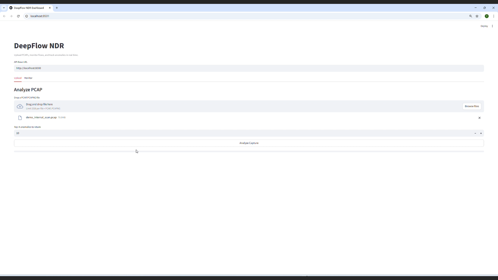

# DeepFlow-NDR

Local, modular Network Detection and Response (NDR) built around a PyTorch
VAE model. The system uses NFStream for flow extraction, FastAPI for backend
inference, and Streamlit for a lightweight UI.

## Demo video

Record a short demo (1-2 minutes) and place it at `docs/demo.mp4`.
Add a thumbnail image at `assets/demo_thumb.png`, then use this link
to open the GitHub Pages player:

[](https://zyffff999.github.io/DeepFlow-NDR/)


## What it does

- Ingest PCAP files and extract flow-level features with NFStream.
- Run a VAE-based anomaly score (reconstruction and/or Mahalanobis).
- Save results to CSV for offline analysis.
- Optional database storage for flow history and metrics.

## NDR-focused highlights

- Feature engineering: curated global stats to enrich byte-level modeling with SOC signals.
- SOC-friendly features: directional bytes/packets, timing stats, rate metrics, TCP flag counts for RCA.
- Explainability hooks: top-contributing byte indices plus global stats per flow.
- Noise-aware filtering: protocol whitelist + service blacklist + interaction quality checks.
- Privacy-aware bytes: address fields are zeroed in the byte matrix before modeling.
- Two-mode pipeline: training ingest/export for offline training, streaming inference for production.
- Ops-ready outputs: per-run CSVs for easy triage or SIEM ingestion.

### Feature engineering summary (22D global stats)

The model consumes a compact, SOC-oriented feature set alongside bytes:

- Basics: duration, total packets, total bytes, mean/std packet size
- Extremes: min/max packet size to surface bursty or injected payloads
- Timing: IAT mean/std to capture cadence and periodicity
- Directionality: src/dst bytes + packet ratios for bidirectional behavior
- Rates: packets/sec, bytes/sec for volumetric patterns
- TCP signals: SYN/RST/PSH/FIN counts + window mean (when available)
- Protocol identity: is_tcp / is_udp flags

## Research note

More technical details and evaluations are documented in the submitted paper
**CONEXT**, which will be released publicly soon.

## Repository layout (high level)

- `configs/config.yaml` - single source of config
- `src/pipeline/` - extraction + tensorization
- `src/services/` - inference + database service
- `src/api/` - FastAPI backend
- `app/` - Streamlit frontend
- `data/` - outputs, checkpoints, training data (ignored by Git)

## Quick start

1) Create and activate environment
```powershell
conda create -n deepflow python=3.10 -y
conda activate deepflow
pip install -r requirements.txt
```

2) Update config
Edit `configs/config.yaml` and set:
- `system.offline_checkpoint_path`
- `system.offline_reference_stats_path` (for Mahalanobis mode)
- `system.offline_pcap_path`

3) Run offline inference (CLI)
```powershell
python test.py
```
Output is written to `data/outputs/offline_YYYYMMDD_HHMMSS.csv`.

4) Run backend + frontend
```powershell
python -m src.api.server
```
In a second terminal:
```powershell
streamlit run app/dashboard.py
```
Open the Streamlit UI and upload a PCAP for analysis.

## Configuration notes

All configuration lives in `configs/config.yaml`.

Key fields you will likely change:

- `system.offline_pcap_path`
- `system.offline_checkpoint_path`
- `system.offline_reference_stats_path`
- `system.anomaly_score_mode` (recon or mahalanobis)
- `system.api_output_dir` (API CSV output)
- `system.offline_output_dir` (offline CSV output)

Global stats features used by the model are listed under:

```
model.global_stats_keys
```

## Training workflow (summary)

1) Ingest raw PCAP to DB (training mode)
```powershell
python -c "from src.services.inference import InferenceService; \
InferenceService(mode='training').ingest_training_pcap(r'C:/path/to/train.pcap')"
```

2) Export training data to NPZ
```powershell
python train_data_export.py
```

3) Train model
```powershell
python -m src.training.main --dataset-config configs/config.yaml --dataset cicids2017
```

4) Compute reference stats (Mahalanobis)
Reference stats are saved during training if enabled:
`training.compute_reference_stats: true`

5) Compute threshold (empirical quantile)
```powershell
python compute_threshold.py --alpha 0.01 --apply-filters --write-config
```

## Outputs

- Offline results: `data/outputs/offline_YYYYMMDD_HHMMSS.csv`
- API results: `data/outputs/api/api_YYYYMMDD_HHMMSS.csv`
- Checkpoints and logs: `data/checkpoints/<timestamp>/`

## Troubleshooting

- If `/analyze` returns 500, check the backend terminal for the traceback.
- If NFStream fails, confirm it is installed in the active environment.
- If CUDA errors appear, run CPU inference or install a PyTorch build that
  supports your GPU architecture.

## Data and large files

`data/` is ignored by Git on purpose. If you need the directory in the repo,
add `data/.gitkeep` and keep large files out of source control.
